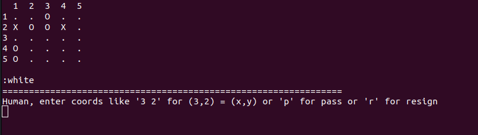

# Deep Learning and the Game of Go - Clojure implementation

A go board game implementation.



Based on the great book:

https://github.com/maxpumperla/deep_learning_and_the_game_of_go

## Start

    $ clj -M src/go/go.clj

### Test

    $ clj -Atest

### Create and use a jarfile

Create an empty classes dir and remove the call to -main in go.go

```
user=> (compile 'go.go)
```

Then run 

    $ java -cp `clj -Spath` go.go
