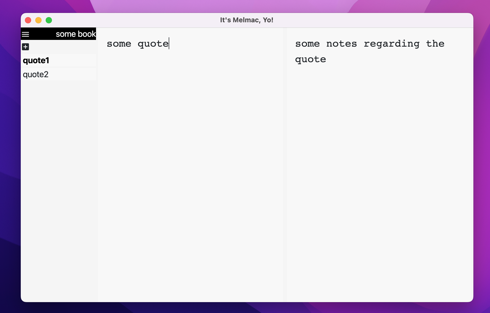

# Melmac

A prototype of a combined writing/citation-collection desktop application,
written with clojurescript, running on electron.



## Installation

Note that this is tested under Mac only.

```
$ npm i
$ npm install -g electron # if not already installed
$ cp src/cljs/melmac/config.cljs.template src/cljs/melmac/config.cljs # edit the store-path then (absolute, with ending slash)
```

Then, assuming the storage folder is `./storage/`, use the `empty.edn.template`'s to generate
entries for texts (copy them to a new name, staying in that folder). Edit the files to set the titles and authors accordingly.

## Start

```
1$ lein figwheel dev
2$ npm start
```

## Test - [broken]

    $ lein doo node test once

## Usage

```
\d as page number to delete a citation
```

## Historical Note

* bootstrapped with https://github.com/Gonzih/cljs-electron
