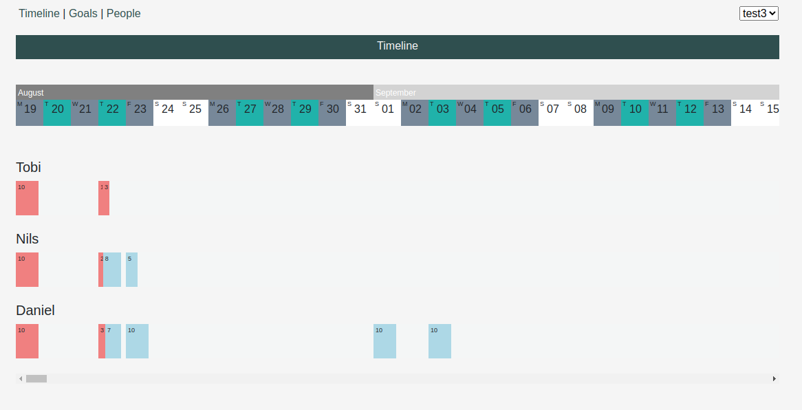
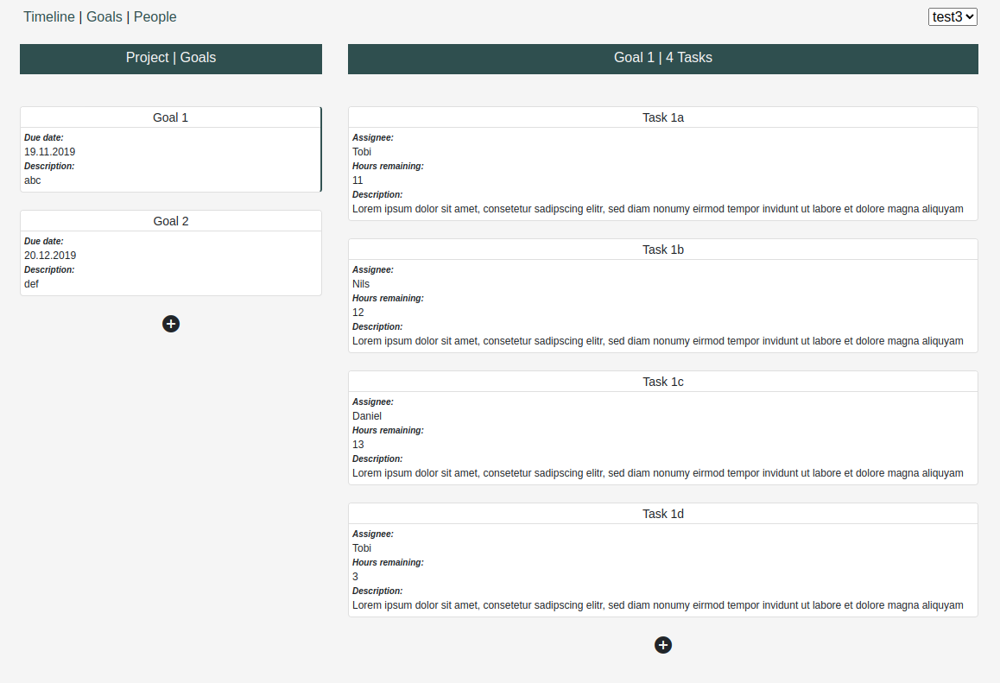

# Plain

Project Planning Tool




## Prerequisites

- sassc (optional)
- fswatch (optional)

## Getting started

Run

```
$ lein figwheel # goto localhost:3449, when app asks for name and pass, use "foo" and "bar"
$ lein test
$ lein test plain.some
$ ./convert-sass.sh # will watch in the background and need to be shut down manually afterwards
```

## Technology Stack

* Clojure Backend
  * Compojure
  * Ring
* Clojurescript Frontend
  * Reagent (React)
* Persistence
  * File based (tbi, @see todos)

## Autogenerated text:

To create a production build run:

    $ lein do clean, cljsbuild once min

And open your browser in `resources/public/index.html`. You will not
get live reloading, nor a REPL. 
