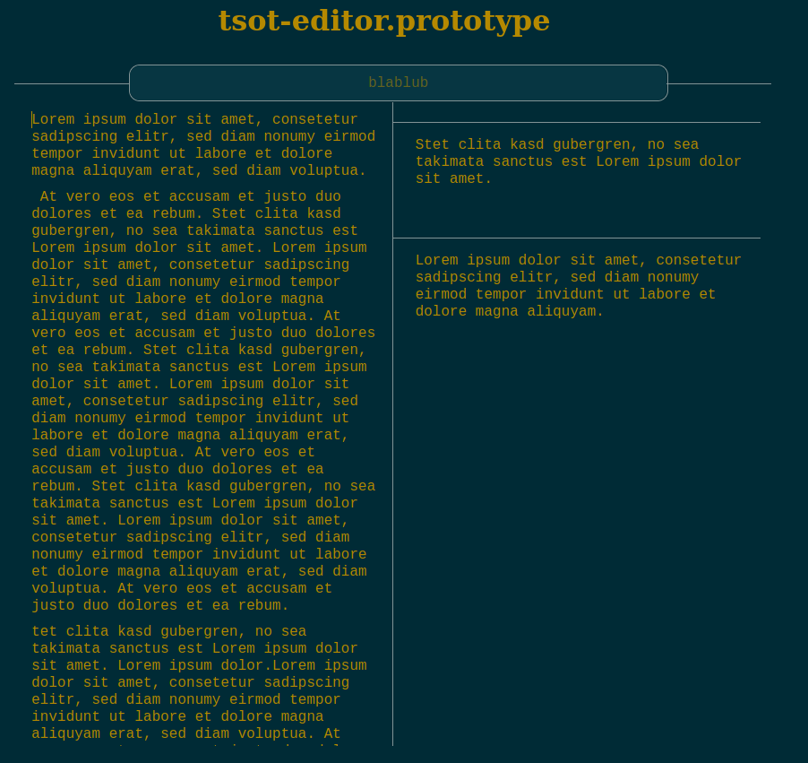
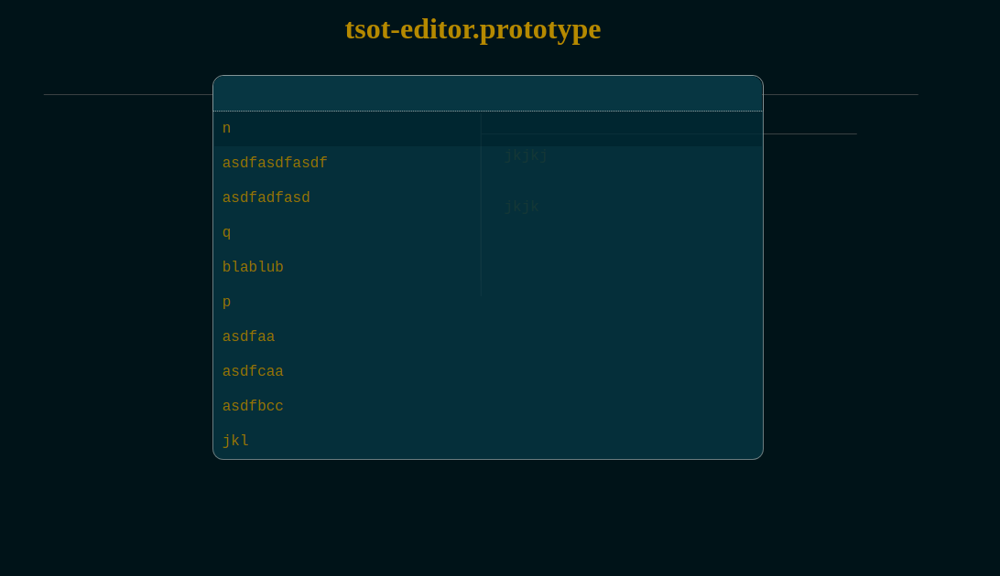
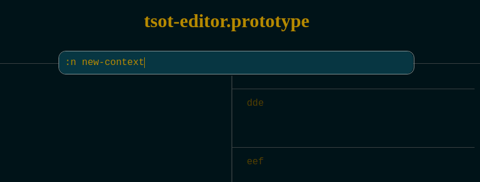

# tsot-editor
    

* Currently developed and tested only under Firefox
* `reagent/re-frame`
* Created via `lein new re-frame tsot-editor +routes`

## Getting started

    $ npm i
    $ npm run watch
    visit http://localhost:8280

## Usage

On the starting screen, select a context.
Note that this is a prototype and the application does not store any data permanently.

### Editing

On the left hand side, there is a single editor,
on the right hand side, multiple editors can be added and edited.

### Navigation

`F8` or clicking into the input field allows 
for switching context and saving the context just left.

`ArrowUp`, `ArrowDown`, `Enter` and mouse clicks work with suggestions.
Enter some search term to narrow down suggestions.

`F2` allows to rename current context. The same is achieved by prefixing
a "search term" with `:r ` in the interface box.

`F4` deletes the current context. First it displays `:d ?`, where one confirms
the deletion by removing the `?`.

Finally, `F1` allows you to create a new context.

Note that only characters `a-z` are generally allowed.

## Tests

Run

    $ clj -Atest
